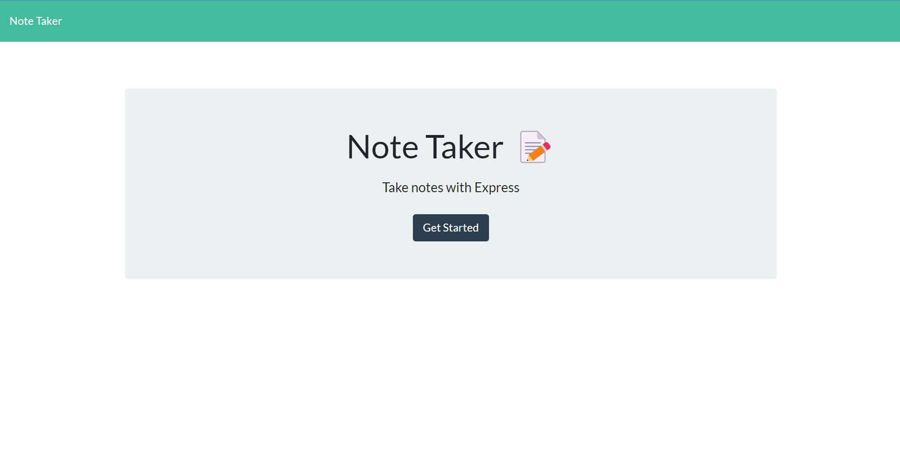
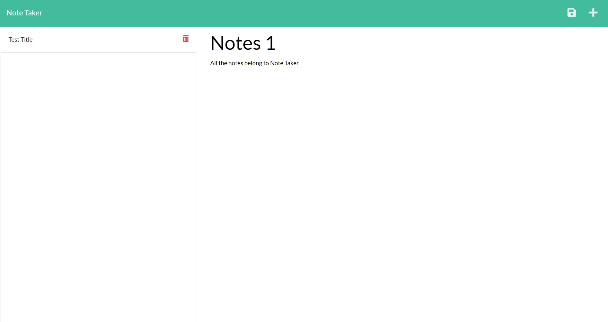

# Note Taker

## About 

An app called that allows users write and save notes.

## Installation

1. Clone this repo 
    ```sh
    git clone gh repo clone Montyking20/note-taker
    ```
2. Install NPM packages
    ```sh
    npm i
    ```

### Usage
After cloning and installing packages. You can access app by typing:
```
npm start
```
or access through heroku at


### [Heroku Note Taker](https://du-note-taker.herokuapp.com/)

<br>

After accessing app:
You can use the app by clicking the button:
```
Get Started
```
From there you are taken to the notes section. On this page you are able to enter text in the main "Notes" section allowing you to enter a note title and note text. The save icon will then appear and the note can be saved. Notes can be deleted with the "trashcan" icon.
<br>

## Repo 

### [Repo Note Taker](https://github.com/Montyking20/note-taker)

<br>

## What it looked like



<br>




